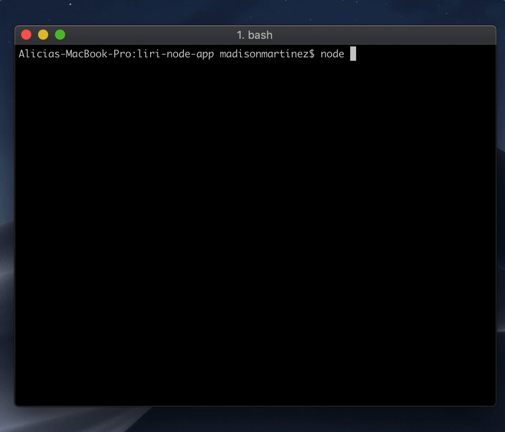
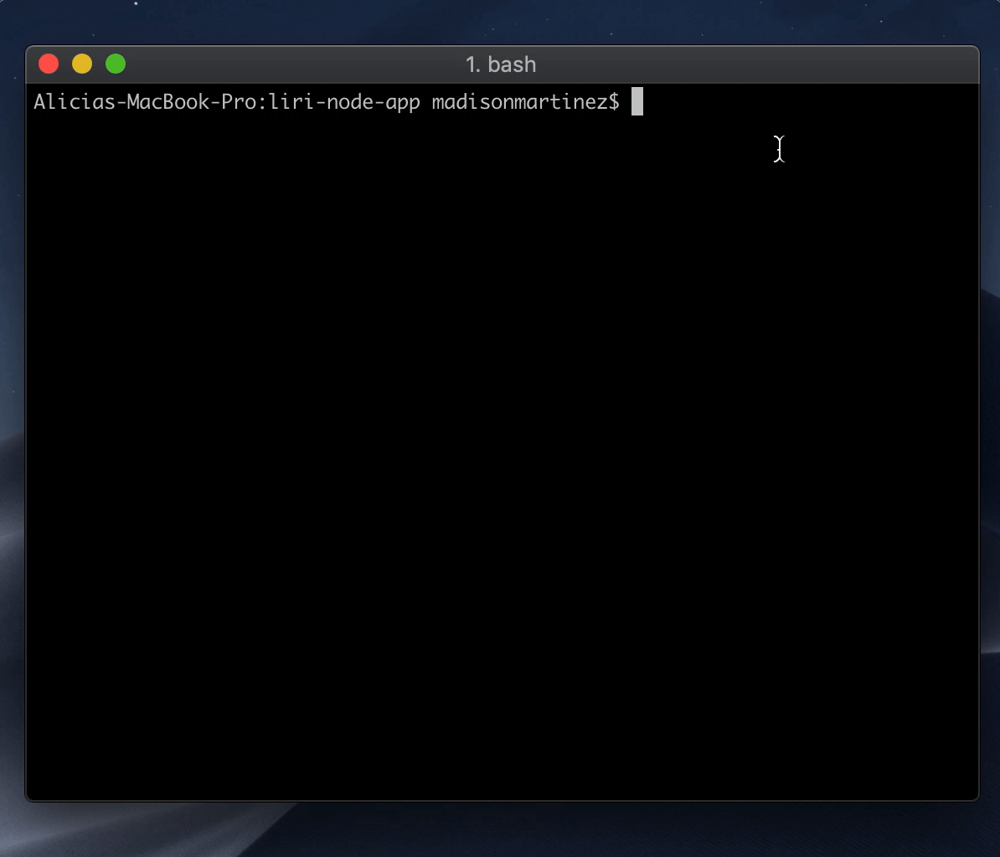
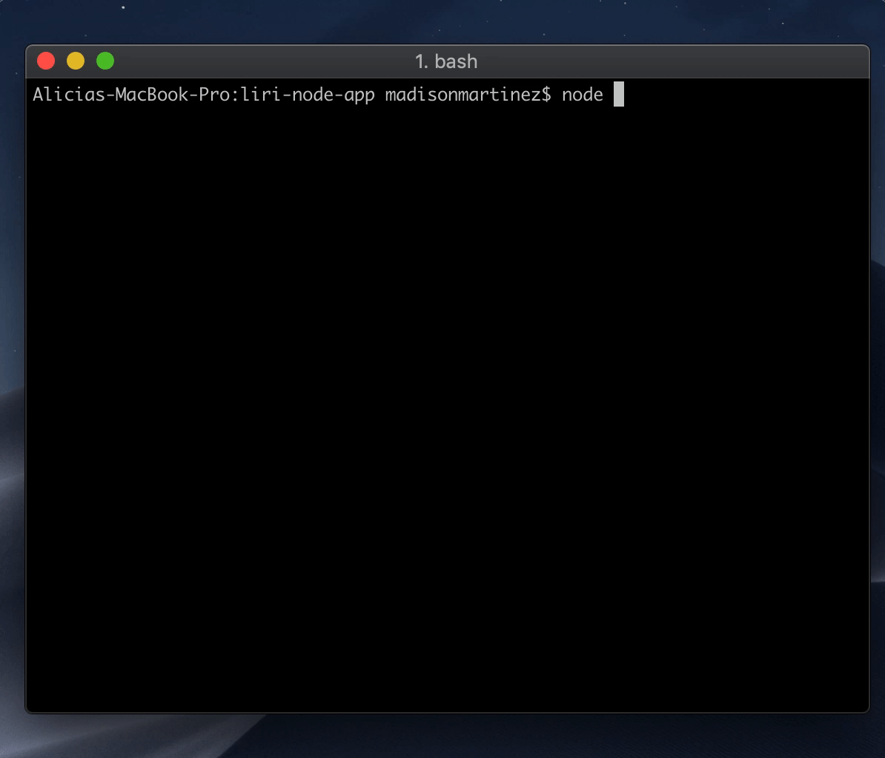

# Liri is here to make your life easier

### Liri searches Spotify, Bands in Town or OMDB for all of your infomation needs.

### To get started, simply open the main file using your terminal and node.js like so (node liri.js) and type a command!

**Acceptable commands liri understands include:**

* spotify-this-song  -- followed by the name of song you want to search
* concert-this -- followed by name of band or artist
* movie-this -- followed by movie title
* do-what-it-says 

**The following information will be returned**

spotify-this: 
* Artist
* Song Name
* Preview URL from Spotify 
* Album Name
**(If no song is provided, the default is "The Sign" by Ace of Base)*

concert-this:
* Name of Venue
* Venue Location
* Date of Event

movie-this:
* Title of the Movie
* Year
* IMDB Rating
* Rotten Tomatoes Rating
* Country
* Language
* Plot
* Actors
**(If no movie is provided, the default is "Mr. Nobody")*

do-what-it-says:
This command will actually read it's command from whatever you put in the random.txt file! For example, typed in there currently is "concert-this,local natives" which will return concert information utilizing the Bands in Town API without the user having to input infomation on the command line.

### Technologies Used
NodeJS, JavaScript, Spotify NPM package, Bands in Town API, OMDB API, NPM Axios, NPM dotenv, Moment NPM package

### Liri in Action

